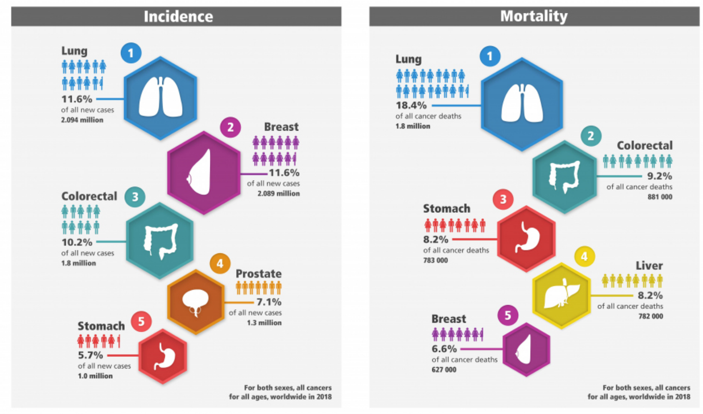
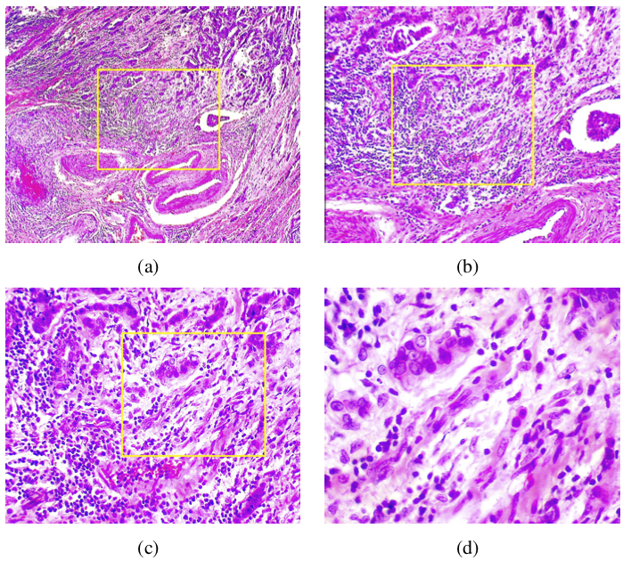
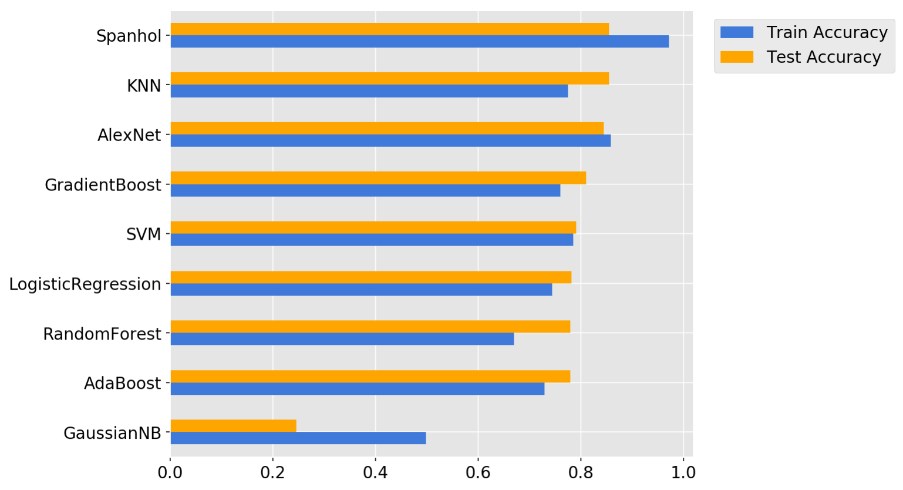
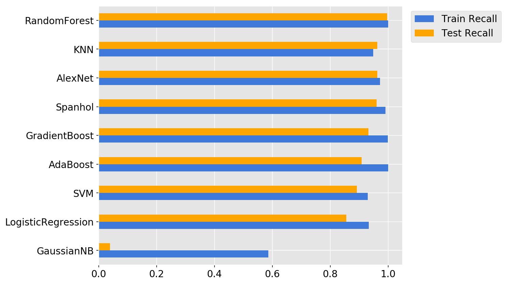
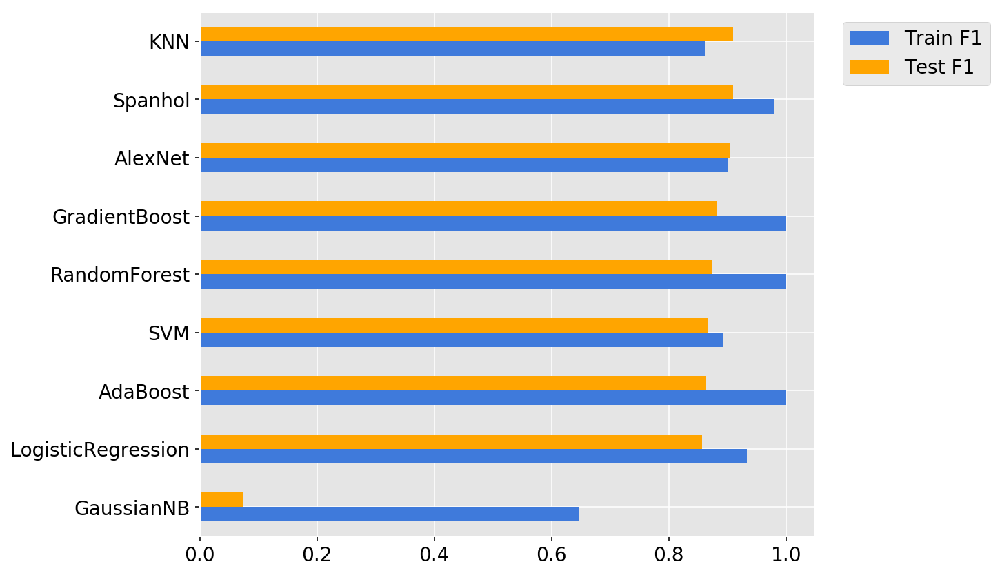
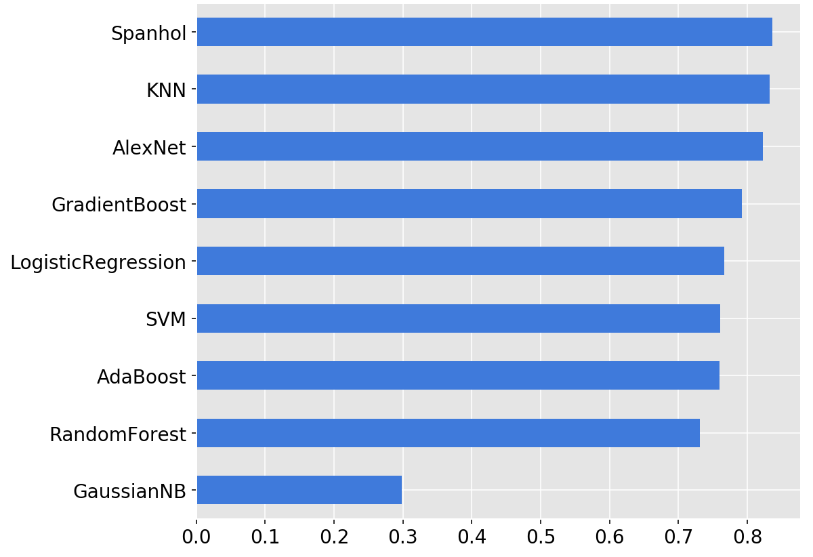

#   Capstone Project: Breast Cancer Image Classification

## Introduction

According to a [report](https://www.who.int/cancer/PRGlobocanFinal.pdf) published by the International Agency for Research on cancer (a branch of the World Health Organization), female breast cancer is among the top three cancer types in terms of incidence and among the top five in terms  of  mortality. Last year, the female breast cancer, along with the lung cancer, were the leading types worldwide in terms of the number of new cases; approximately 2.1 million diagnoses were estimated in 2018 which contributed about 11.6% of the total cancer incidence. In addition, female breast cancer is ranked as the fifth leading cause of death across the world (627,000 deaths, 6.6%). 

Although, nowadays, the breast cancer is the most commonly diagnosed cancer in women (about 1 in 4 of all cases worldwide are diagnosed), however, it is still the leading cause of female cancer death (15.0%). So, more advanced detection techniques are extremely in demand in order to diagnose the breast cancer in earlier stages and with higher confidence. Despite the conventional imaging procedures, such as diagnostic mammograms (X-rays), magnetic resonance imaging (MRI), ultrasound (sonography), and thermography ([ref](https://www.ncbi.nlm.nih.gov/books/NBK22315/pdf/Bookshelf_NBK22315.pdf)), histopathological analysis based on surgical biopsy of the affected tissue offers the most promising and the gold standard in diagnosing almost all types of breast cancer ([ref](https://www.ncbi.nlm.nih.gov/pmc/articles/PMC3587978/pdf/nihms360146.pdf)). Histology is the study of the microscopic anatomy of cells and tissues of organisms. Histological analysis is performed by examining a thin slice (section) of tissue under an optical or electron microscope. However, meticulous analysis of the resulting images poses a serious challenge due to several factors, including the availability of experienced pathologists, the time-consuming nature of the process, and the fatigue and decrease of attention of the specialists. So, as indicated by [Gurcan *et al.*](https://www.ncbi.nlm.nih.gov/pmc/articles/PMC2910932/pdf/nihms-173561.pdf), computer-assisted diagnosis (CAD) is in high demand to lower the workload of pathologists by filtering obviously benign areas, so that the experts can focus on the more difficult-to-diagnose cases. 

## Dataset

The biopsy images used in this study are taken from the Breast Cancer Histopathological Database ([BreakHis](https://web.inf.ufpr.br/vri/databases/breast-cancer-histopathological-database-breakhis/)) which is composed of 7,909 microscopic images of breast tumor tissue collected from 82 patients using different magnifying factors (40X, 100X, 200X, and 400X). This database is built in collaboration with the [P&D Laboratory](http://www.prevencaoediagnose.com.br) (Pathological Anatomy and Cytopathology, Parana, Brazil) and, in total, contains 2,480 benign and 5,429 malignant samples (700X460 pixels, 3-channel RGB, 8-bit depth in each channel, PNG format). The images in this database are divided into two main groups: benign tumors and malignant tumors. The distribution and types of images at each magnification factor are given in the following table:

| Magnification | Benign | Malignant | Total |
| --- | --- | --- | --- |
40X  | 652 | 1,370 | 1,995 |
100X | 644 | 1,437 | 2,081 |
200X | 623 | 1,390 | 2,013 |
400X | 588 | 1,232 | 1,820 |
Total of Images 	| 2,480 | 5,429 | 7,909 |

In addition, the images are sorted into 8 different subtypes based on the way the tumoral cells look under the microscope. The dataset currently contains four histological distinct types of benign breast tumors: 

- adenosis (A), 
- fibroadenoma (F), 
- phyllodes tumor (PT), and 
- tubular adenona (TA);  

and four malignant tumors (breast cancer): 

- carcinoma (DC), 
- lobular carcinoma (LC), 
- mucinous carcinoma (MC), and, 
- papillary carcinoma (PC).

As an example, four slides of malignant breast tumors in different magnification factors of (a) 40X, (b) 100X, (c) 200X, and (d) 400X are shown below.

This database has been utilized in several scientific studies to develop algorithms for automated classification of these images in two main classes of benign or malignant ([ref1](http://www.inf.ufpr.br/lesoliveira/download/TBME-00608-2015-R2-preprint.pdf), [ref2](http://www.inf.ufpr.br/lesoliveira/download/IJCNN2016-BC.pdf), [ref3](http://www.inf.ufpr.br/lesoliveira/download/SpanholSMC2017.pdf)) or in eight subclasses mentioned above ([ref4](https://www.nature.com/articles/s41598-017-04075-z.pdf), [ref5](http://thesai.org/Downloads/Volume9No6/Paper_45-Multi_Class_Breast_Cancer_Classification.pdf), [ref6](https://www.biorxiv.org/content/biorxiv/early/2018/01/04/242818.full.pdf)). In these investigations, a variety of different classification techniques have been employed which range from conventional methods such as random forest and support vector machine to state-of-the-art deep learning schemes.

## Preparation of Data

In this project, considering the constraints of time and computational power, I chose to concentrate only on the images captured using the lowest magnification, i.e., 40X. In practice too, the pathologists start the diagnosis process by  identifying the tumor and defining a region of interest based on the images with the lowest resolution. 

In the original configuration of [BreakHis](https://web.inf.ufpr.br/vri/databases/breast-cancer-histopathological-database-breakhis/) dataset, the image files are spread across different folders categorized based on tumor subtype for each individual patient. So, first I developed a notebook called [Image_Select](./Notebooks/Image_Select.ipynb) in order to collect the images with magnification factor of 40X for all patients from all different folders and put them together in a single folder called `Images`. To verify the process, I checked the total number of copied files and found out that it agrees with the number of 40X images given in the table above.

In the next step, I developed a script called [Image_Spec](./Notebooks/Image_Spec.ipynb) to gather the specifications of each image. As indicated in the [BreakHis info page](https://web.inf.ufpr.br/vri/databases/breast-cancer-histopathological-database-breakhis/), the name of each image file contains some information as follows,

- the corresponding patient identification number, 
- the type of tumor $\rightarrow$ benign (B) or malignant (M),
- the subtype of tumor,
- the magnification factor of that image, and,
- the sequence number of the image for that particular patient.

In the aforementioned notebook, using the folder of images prepared before, I extracted of specification of each image and then stored that information in a data frame. According to the information given by the curators of the [BreakHis](https://web.inf.ufpr.br/vri/databases/breast-cancer-histopathological-database-breakhis/), all images are supposed to be 460 $\times$ 700. However, I realized that for one of the patients, the images width is different than 460. Since these few non-matching images will create problems in later analysis of the dataset, I dropped those images from the data frame. For later reference, this data frame is saved as a CSV file called `specs.csv`.

## Preprocessing

In order to meaningfully apply the machine learning techniques, the data should be first split into two subsets, train and test. Later, considering the substantial number of features present in each image, a feature extraction technique should be utilized to render the size of data manageable. 

### Train/Test Split

As proposed by Spanhol *et al.* ([ref](http://www.inf.ufpr.br/lesoliveira/download/TBME-00608-2015-R2-preprint.pdf)), in order to avoid diffusing the images of unseen patients to the training set and to make the resulting classification model as generalizable as possible, a patient-wise train/test split strategy is devised. This process has been performed in a script called [TT_Split](./Notebooks/Image_Spec.ipynb). I chose to randomly pick 75% of patients for the training set and the remaining 25% of patients for the test set. The information of images corresponding to each set is extracted and are stored in to distinct data frames to be later used in order to build the classifier.

### Feature Extraction using PCA

In this dataset, each raw image in the original format, contains 460 $\times$ 700 $\times$ 3 = 966,000 features, rendering the training process extremely cumbersome, if not impossible. So, we need a feature extraction technique which reduces the number of features while preserves the principal structure of the images. To this end, I employed the PCA method to fit the training images and used the corresponding results to transform both the train and test sets in a script called [PCA_analysis](./Notebooks/PCA_analysis.ipynb). The number of principal components is selected in a way that the resulting array can explain 99% of variability in the training data. By rendering the PCA technique, the number of features for each image is reduced to 1346 which offers a great boost in terms of optimizing the classification algorithm while retaining the fundamental architecture of the training images. At the end, the resulting PCA arrays along with the target data are stored using a `Numpy` compressed format.

## Modeling

In order to train a classifier to categorize the histopathological images into malignant and benign classes, I employed two fundamentally different approaches. In the first one, I used the conventional machine learning techniques based on features extracted by the PCA procedure. In the other one, sophisticated deep learning configurations based on convolutional neural networks were used to categorize the raw images.

### Conventional Methods

In the first approach, using the PCA transformed arrays of train and test image sets, a variety of different classification algorithms have been employed to recognize the type of tumor. These techniques are:

- Logistic Regression
- $k$-Nearest Neighbors
- Gaussian Naive Bayes
- Random Forest
- Adaptive Boosting
- Gradient Boosting
- Support Vector Machine

In order to find the optimal conditions for each classifier, a grid search is utilized which selects the best set of hyperparameters using the outcomes of a 5-fold cross validation scheme. Eventually, for each model, the best hyperparameters along with different classification metrics (accuracy, recall, and F$_1$ score) are calculated and stored in a data frame. These computations are carried out in a notebook called [Models_pca](./Notebooks/Models_pca.ipynb).

The aforementioned metrics evaluate the performance of the classifier at the image level. However, in practice, a pathologist makes their decision patient-wise. So, we need a difference kind of metric to assess the efficacy of the resulting classifier at the patient level. Here, utilizing the method proposed by [Spanhol *et al.*](http://www.inf.ufpr.br/lesoliveira/download/TBME-00608-2015-R2-preprint.pdf), first I calculated the patient score as,

$$\text{Patient Score} = \frac{N_{rec}}{N_p}$$

where, $N_p$ is the number images of patient $p$ and $N_{rec}$ is the number of images correctly classified for that patient. Then, we can find the global recognition rate as, 

$$ \text{Recognition Rate} = \frac{\sum \text{Patient Score}}{\text{Total number of patients}}$$

This parameter represents the accuracy of the classification algorithm at the patient level. So, I calculated that in addition to the previously mentioned metrics.

### Deep Learning 

In recent yers, the convolutional neural networks (CNNs) have been widely used to achieve state-of-the-art results in different image recognition problems. In deep learning techniques, the convolutional layers are capable of automatically learning the appropriate textural features for classification tasks while in conventional machine learning methods these features should be extracted beforehand requiring expert domain knowledge.

Here, I used two different configurations of CNNs to classify the images present in the BreakHis dataset. The first one, called [AlexNet](https://papers.nips.cc/paper/4824-imagenet-classification-with-deep-convolutional-neural-networks.pdf), is originally developed by Alex Krizhevsky in 2012 and achieved the highest score in classifying the images in the [ImageNet](http://www.image-net.org/) Large Scale Visual Recognition Challenge. In this project, I used a slightly modified AlexNet model which contains 5 convolutional layers and 4 dense layers. In order to address the issue of overfitting, some dropout layers too have been added between the dense layers. In total, this model contains more than 32 million trainable parameters.

The second model is a CNN configuration proposed by [Spanhol *et al.*](http://www.inf.ufpr.br/lesoliveira/download/IJCNN2016-BC.pdf) to classify the images of the BreakHis dataset. This model contains 3 convolutional layers and 2 dense layers. A dropout layer too has been added before the output layer to reduce the variance in the predictions. In total, this model contains more than 4 million trainable parameters.

Both models are fed with the raw images taken from the BreakHis dataset and to lower the size of computations, the images are resized to be 230 $\times$ 350. Then, the image data are scaled by subtracting from the mean of the train set and by dividing by the overall maximum value which is 255.  In both cases, a check point is defined to store the weights of the model whenever the network reaches a peak in terms of accuracy of predicting the labels of the test set. At the end, this best model is called from the disk and the corresponding values of the accuracy, sensitivity, F$_1$ score and the recognition rate are calculated in a notebook called [Models_deep](./Notebooks/Models_deep.ipynb).

## Results

I developed a note book called [Viz_maker](./Notebooks/Viz_maker.ipynb) to plot and compare these metrics for different classification methods. The following graphs represent the accuracy, sensitivity (recall), F$_1$ score, and recognition rate for these algorithms methods for both the train and test data sets,

   
  Accuracy

   
  Sensitivity (Recall)

   
  F1 score

  

  Recognition rate for the test data set

The graphs indicate that the performance of the deep learning models is mostly superior compared to the conventional techniques. it is also worth noting that the full potential of the CNN schemes is not explored in this study.

## Future Work

The outcomes of this project can be improved in multiple ways. As noted before, in order to apply the conventional classification algorithms, the important features of the images should be picked beforehand. Here, I used PCA to achieve this purpose, however, there are more advanced feature extraction techniques which are more appropriate for medical images. These methods include Local Binary Patterns ([LBP](http://www.ee.oulu.fi/mvg/files/pdf/pdf_94.pdf)), Parameter-Free Threshold Adjacency Statistics ([PFTAS](https://www.ncbi.nlm.nih.gov/pubmed/17394669)), etc. These textural descriptors can be employed to more effectively engineer new features representing the configuration of the images.

The performance of deep learning algorithms can be elevated with data augmentation and transfer learning. [Augmentation](https://arxiv.org/abs/1609.08764) methods are frequently used for oversampling data categorized in imbalanced classes. It is shown that utilizing data augmentation enhances the accuracy of CNNs while reducing their sensitivity towards the noise in unseen images. 

Transfer Learning is the reuse of a pre-trained model on a different problem. It is popular in deep learning given the enormous resources required to train deep learning models or the large and challenging datasets on which deep learning models are trained. It is customary to perform transfer learning with predictive modeling problems that use image data as input. For image recognition problems, it is common to use a deep learning model pre-trained for a large and challenging image classification task such as the [ImageNet](http://www.image-net.org/) 1000-class photograph classification competition. In this case, it is noticeable that CNN features are more generic in early layers and more original-dataset-specific in later layers. 

